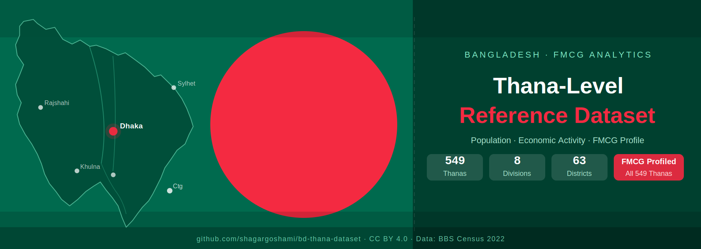

<p align="center">
  <a href="data/thana_reference.csv"></a>
  <a href="data/summary_division.csv"></a>
  <a href="data/summary_district.csv"></a>
  
  
  <a href="LICENSE"></a>
</p>

---

A structured, analysis-ready dataset covering all **549 thanas/upazilas** across **8 divisions** and **63 districts** of Bangladesh — built for FMCG sales operations, territory planning, Power BI dashboards, and consumer profiling.

---

## What's Inside

| Sheet / File | Description | Rows |
|---|---|---|
| `thana_reference` | Administrative hierarchy + population (2022 est.) + area + density | 549 |
| `thana_economic_activity` | Primary sector, sub-activity (dominant livelihood), FMCG trade class, market classification | 549 |
| `thana_fmcg_consumer_profile` | Consumer profile tag, likely FMCG categories, distribution priority (A/B/C) | 549 |
| `summary_division` | Division-level rollup | 8 |
| `summary_district` | District-level rollup | 63 |
| `summary_sector` | Sector / trade class / market class breakdown | 12 |

---

## Key Fields

### Administrative Reference (`thana_reference.csv`)

| Field | Description |
|---|---|
| Division | One of 8 administrative divisions |
| District | One of 63 districts (zila) |
| Thana / Upazila | Sub-district unit (upazila or city thana) |
| Thana Type | `Upazila` / `City Thana` / `City/Upazila` |
| Population (Est. 2022) | Estimated population from BBS 2022 Census (prelim) |
| Area (sq km) | Land area |
| Pop. Density (per sq km) | Population / Area |
| Division Code | 2-digit BBS code |
| District Code | 4-digit code (Division + District) |

### Economic Activity (`thana_economic_activity.csv`)

| Field | Description |
|---|---|
| Primary Sector | `Agriculture` / `Industry` / `Services` / `Mixed` |
| Sub-Activity | Dominant livelihood (e.g. *Rice / haor fishing*, *Garments / EPZ*, *Tea / rubber*) |
| FMCG Trade Class | `General Trade` / `Modern Trade` / `Mixed (GT+MT)` / `Industrial GT` |
| Market Classification | `Urban` / `Semi-Urban` / `Rural` / `Industrial` |

### FMCG Consumer Profile (`thana_fmcg_consumer_profile.csv`)

| Field | Description |
|---|---|
| Consumer Profile Tag | e.g. *Premium Urban Consumer*, *Mass Rural Consumer*, *Remittance-Driven Consumer* |
| Likely Top FMCG Categories | Key product categories by consumption likelihood |
| Distribution Priority | `A` = High / `B` = Medium / `C` = Low |

---

## Use Cases

- **FMCG territory planning** — segment thanas by trade class and distribution priority for SR beat design
- **Distributor coverage gap analysis** — identify Priority A/B thanas with no current coverage
- **Power BI dimension table** — join on `Thana / Upazila` to sales transaction data for geographic drill-down
- **Consumer segmentation** — filter by consumer profile tag to align category focus by geography
- **RTM (Route-to-Market) mapping** — use market classification to distinguish urban vs rural channel strategy

---

## Repository Structure

```
bd-thana-dataset/
├── README.md
├── LICENSE
├── data/
│   ├── BD_Thana_Economic_Profile.xlsx    ← Full formatted workbook (6 sheets)
│   ├── thana_reference.csv               ← Admin + population data
│   ├── thana_economic_activity.csv       ← Sector + sub-activity + trade class
│   ├── thana_fmcg_consumer_profile.csv   ← Consumer profile + priority
│   ├── summary_division.csv              ← Division rollup
│   ├── summary_district.csv              ← District rollup
│   └── summary_sector.csv                ← Sector / trade class breakdown
├── docs/
│   ├── banner.svg                        ← Repository banner image
│   └── data_dictionary.md                ← Full field definitions
└── scripts/
    └── load_thana_data.py                ← Python loader / quick-start script
```

---

## Quick Start

### Python

```python
import pandas as pd

thana   = pd.read_csv("data/thana_reference.csv")
econ    = pd.read_csv("data/thana_economic_activity.csv")
profile = pd.read_csv("data/thana_fmcg_consumer_profile.csv")

# Merge all three on Division + District + Thana
df = thana.merge(econ,    on=["Division","District","Thana / Upazila"]) \
          .merge(profile, on=["Division","District","Thana / Upazila"])

# Priority A thanas in Dhaka division
print(df[(df["Division"]=="Dhaka") & (df["Distribution Priority"]=="A")]
      [["District","Thana / Upazila","Consumer Profile Tag","FMCG Trade Class"]])
```

### Power BI

1. `Get Data → Text/CSV` → load `thana_reference.csv`
2. Repeat for `thana_economic_activity.csv` and `thana_fmcg_consumer_profile.csv`
3. In Model view, create relationships on `Thana / Upazila` (and `Division` + `District` for uniqueness)
4. Use `FMCG Trade Class`, `Market Classification`, `Distribution Priority` as slicer fields

---

## Data Sources

| Source | Coverage |
|---|---|
| Bangladesh Bureau of Statistics (BBS) — Population & Housing Census 2022 (preliminary) | Population estimates |
| BBS Population & Housing Census 2011 (final) | Area, administrative boundaries |
| Local Government Division, Ministry of Local Government | Administrative hierarchy |
| FMCG trade class & consumer profile classifications | Expert-derived, FMCG sector conventions |

> **Note:** Population figures are estimates. Final verified 2022 Census data should be sourced directly from BBS for official reporting.

---

## Author

<p align="center">
  <b>Shagar Goshami</b><br/>
  <a href="https://linkedin.com/in/shagargoshami">
    
  </a>
  &nbsp;
  <a href="https://github.com/shagargoshami">
    
  </a>
</p>

---

## License

This dataset is released under the [Creative Commons Attribution 4.0 International (CC BY 4.0)](LICENSE) license.
You are free to use, share, and adapt for any purpose — with attribution.
